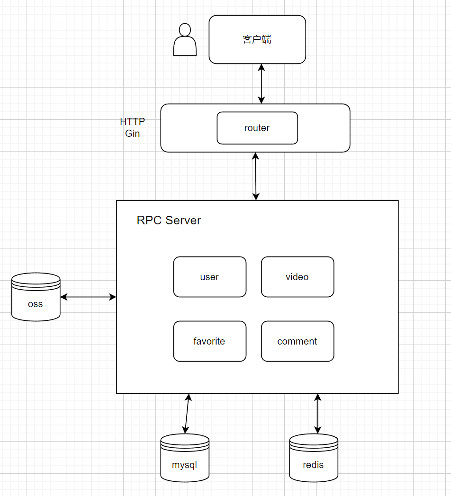
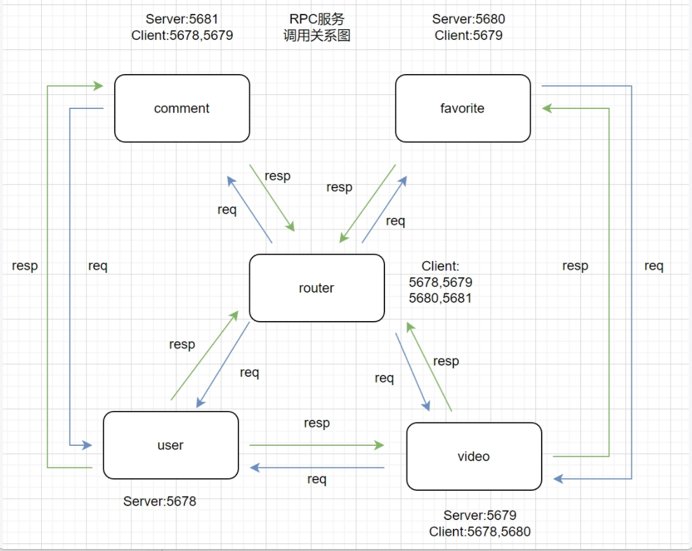
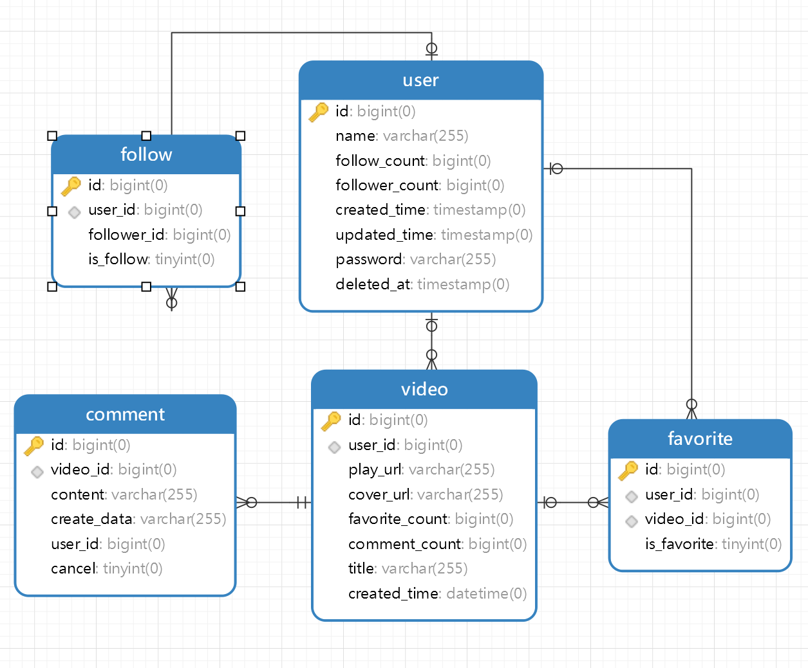

# 运行
- 执行 go mod tidy
- 分别运行services包下的五个服务的main.go
- 抖声ip改成运行主机的内网 ip:8080

# 工具类使用
- 雪花算法生成唯一id：go get github.com/sony/sonyflake
- jwt生成Token : go get github.com/golang-jwt/jwt/v4
- viper读取配置类文件xxx.yml : go get github.com/spf13/viper
- 对象存储 : go get -u github.com/tencentyun/cos-go-sdk-v5
- redis：go get github.com/go-redis/redis/v8
- 接口限流: "golang.org/x/time/rate"

# 架构设计

# RPC服务调用关系

# 数据库表结构

# 说明
- 测试用例：https://www.apifox.cn/apidoc/shared-37482a3f-1ede-4edc-bcdc-aa8a47389b24
- 用的数据库在云服务器，也可以自己在本机上运行sql添加数据
- app在鸿蒙系统运行时视频发布的功能会失效，请求发不出来
- 生成token的负载中带了用户id和用户名，并按 [键（token）:用户id用户名字（值）]的方式存入redis中
- 目前的token检验方法是把redis的数据与解析前端token后获得的数据进行比对
- 为了方便查看密码目前还没加md5加密
- 如果要运行腾讯云密钥可以自行准备，也可以联系我

# 目前仍存在的问题
- 因为时间原因，评论模块没有完成redis持久化。
- 评论后无法及时刷新评论列表
- 发布视频的大小无法超过4M