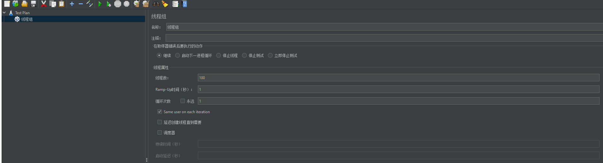

## 1. 为什么要做限流

首先我们来看看注册的代码:

```go
	if dao.IsUserExist(userName) {
		ctx.JSON(http.StatusBadRequest, pb.DouyinUserRegisterResponse{
			StatusCode: 1,
			StatusMsg:  "注册失败，该用户名已存在",
		})
		return
	}
```

它查询用户是否被重复注册实际上这个sql是要打到`sql`上的,如果不加以限制,那么有可能就会被暴力攻击

- 攻击数据库,数据库压力过大
- 暴力尝试密码,破解用户密码

> 因此做一个接口的限流是非常重要的

## 2. 登录&注册接口限流实现

限流功能的理论

https://mp.weixin.qq.com/s/kyFAWH3mVNJvurQDt4vchA

这个功能我基于令牌桶进行实现,实现的基础是用`go官方提供的依赖`

- 第一步:引入依赖

```sh
go get golang.org/x/time/rate
```

- 第二步:编写限流工具类

```go
package utils

import (
	"golang.org/x/time/rate"
	"sync"
	"time"
)

/**
* 接口限流工具
*
* @author: 张庭杰
* @date: 2023年02月17日 16:25
 *
*/

type Limiters struct {
	limiters *sync.Map
}

type Limiter struct {
	limiter *rate.Limiter
	lastGet time.Time //关键参数:上一次获取token的时间,是我们标记用户访问接口的关键参数
	key     string
}

var GlobalLimiters = &Limiters{
	limiters: &sync.Map{},
}
var once = sync.Once{}

// NewLimiter 通过传入{r:往桶里放Token的速率,b:令牌桶的大小,可以对某个id/ip做限制},新建一个自定义的限流器
func NewLimiter(r rate.Limit, b int, key string) *Limiter {
	once.Do(func() {
		go GlobalLimiters.clearLimiter()
	})
	keyLimiter := GlobalLimiters.getLimiter(r, b, key)
	return keyLimiter
}

func (l *Limiter) Allow() bool {
	l.lastGet = time.Now()
	return l.limiter.Allow()
}

// r:往桶里放Token的速率 b:令牌桶的大小 key:可对某id\ip做限制
func (ls *Limiters) getLimiter(r rate.Limit, b int, key string) *Limiter {
	limiter, ok := ls.limiters.Load(key)
	if ok {

		return limiter.(*Limiter)
	}
	l := &Limiter{
		limiter: rate.NewLimiter(r, b),
		lastGet: time.Now(),
		key:     key,
	}
	ls.limiters.Store(key, l)
	return l
}

// 清除过期的限流器
func (ls *Limiters) clearLimiter() {
	for {
		time.Sleep(1 * time.Minute)
		ls.limiters.Range(func(key, value interface{}) bool {
			//超过1分钟
			if time.Now().Unix()-value.(*Limiter).lastGet.Unix() > 60 {
				ls.limiters.Delete(key)
			}
			return true
		})
	}
}

```

- 第三步:限流器的具体使用方法(重要)

以注册接口为例

```go
func requestIsAllow(r int, capacity int, identify string) bool {
	/*登录接口限流实现*/
	//1. 创建新的限流器
	//参数说明
	// r: 每10ms可以接受一次注册
	// b: 桶中可以放100的令牌
	// key:限制userName
	limiter := utils.NewLimiter(rate.Every(10*time.Millisecond), 100, identify)
	//3. 检查是否超过限流的限制
	return limiter.Allow()
}
```

然后在业务执行前加上这一段

```go
	userName := request.GetUsername()
	if !requestIsAllow(10, 100, userName) {
		ctx.JSON(http.StatusBadRequest, pb.DouyinUserLoginResponse{
			StatusCode: 2,
			StatusMsg:  "操作过于频繁!",
		})
		return
	}
```

即可完成限流的工作

## 3. 限流效果测试

这里手工测试比较难,我采用的是一个`jmeter`的方式进行测试

测试流程:



首先设置的线程的模型是1秒内并发100次请求,显然后续的请求是不应该被接收的,因此必须做限流


> 注意,这个参数还需要细调,不然的话起不到效果

## 4. 实现全局唯一性ID(不破坏索引结构)

```go
func NextId(serviceKey string) int64 {
	//1. 获取当前时间戳
	timeStamp := time.Now().Unix()
	//2.获取当前的日期
	date := time.Now().Format(LAYOUT)
	//3. 从redis中取序号
	//3.1 组装key
	key := "icr:" + serviceKey + date
	//3.2 连接redis并且取数据
	seq, err := RedisDb.Get(ctx, key).Int()
	//3.3 在取完数据之后,自增,避免重复ID
	RedisDb.Incr(ctx, key)
	if err != nil {
		fmt.Printf("获取redis数据失败!---全局唯一性ID,%s", err)
		return 0
	}
	fmt.Printf("从redis中获取到的key为:%d", seq)
	if err != nil {
		return 0
	}
	//4. 拼接ID并且返回
	return (timeStamp << SeqBits) | int64(seq)
}
```

## 5. 实现视频的缓存

缓存和数据库一致性策略采取的是`旁路缓存策略`

主要流程为:

- 当添加视频时,删除缓存数据(缓存清理)
- 当请求视频接口的时候,检查缓存是否有数据,如果没有数据,那么将请求打到数据库上(缓存重建)

关键代码如下:

```go
	if data == nil {
		//3.1 重建缓存
		db.Db.Where("user_id=?", request.UserId).Find(&videoList)
		//3.2 序列化缓存数据
		jsonString, err := json.Marshal(videoList)
		if err != nil {
			return nil
		}
		//3.3 将数据加入到缓存中
		utils.RedisDb.Set(ctx, key, jsonString, -1)
	} else {
		//4. 走缓存
		bytes, err := data.Bytes()
		if err != nil {
			return nil
		}
		//4.1 将缓存中的对象反序列化为videoList
		err = json.Unmarshal(bytes, videoList)
		if err != nil {
			return nil
		}
	}
```

## 6. 点赞模块的具体实现

点赞的实战案例参考的是我以前学习的这篇文章:https://lumxi.github.io/2023/01/16/Redis/Redis-4/

首先是第一个接口:`/douyin/favorite/action/ - 赞操作`

这个操作需要完成两个功能:

- 统计这个视频有多少人点过赞
- 点过赞的有谁,如果他点过赞了,那么下次页面显示的时候就显示红心被点亮了

于是设计数据结构

| Set名称                          | value  |
| -------------------------------- | ------ |
| video:like_list:video_id(自定义) | userId |

第一个功能,通过获取`set`的size即可

第二个功能,通过`isMember()`方法即可

```go
// 处理用户点赞的状态
func handleIsLike(videoId int64, isFavorite bool, userId int64) (err error) {
	/*组装对应的key*/
	key := consts.VIDEO_LIKED_KEY + strconv.FormatInt(videoId, 10)
	/*检查一下这个用户是否在set中*/
	isMember, err := utils.RedisDb.SIsMember(ctx, key, userId).Result()
	if err != nil {
		return err
	}
	if isFavorite {
		//1. 判断类型:用户点赞,那么就是要将这个用户加入到set中
		if isMember {
			//如果已经在集合中了,那么就是无效操作,直接返回即可
			return nil
		}
		//1.1 否则的话,就将这个用户加入到redis中
		success, err := utils.RedisDb.SAdd(ctx, key, userId).Result()
		if success == 1 { //操作成功
			return nil
		}
		return err
	}
	//2. 如果是取消点赞,那么将用户从set中删除
	if !isMember { //如果用户都在不在集合中,又想取消点赞,那么肯定是错误的操作
		return nil
	}
	//2.1 否则的话就将这个用户从里面删除
	success, err := utils.RedisDb.SRem(ctx, key, userId).Result()
	if success != 1 || err != nil {
		return err
	}
	return nil
}
```

然后是第二个接口,这个接口要做的功能是`/douyin/favorite/list/`,登录用户的所有点赞视频。

就是说获取到当前用户的`ID`,将用户点赞过的所有视频都找出来,然后返回回去

如果是基于redis的话,那么就希望能够以快速的方式返回这些数据,而且这些数据能够有一定排序,因此最终采用`Zset`的数据结构

第一步,先修改之前的代码,将用户点赞的操作进行改造

```go
_, err = utils.RedisDb.ZAdd(ctx, userLikedKey, &redis.Z{
			Score:  float64(time.Now().Unix()),
			Member: videoId,
		}).Result()
```

第二步,添加`Zset`核心代码


