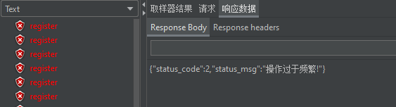

## 1. 为什么要做限流

首先我们来看看注册的代码:

```go
	if dao.IsUserExist(userName) {
		ctx.JSON(http.StatusBadRequest, pb.DouyinUserRegisterResponse{
			StatusCode: 1,
			StatusMsg:  "注册失败，该用户名已存在",
		})
		return
	}
```

它查询用户是否被重复注册实际上这个sql是要打到`sql`上的,如果不加以限制,那么有可能就会被暴力攻击

- 攻击数据库,数据库压力过大
- 暴力尝试密码,破解用户密码

> 因此做一个接口的限流是非常重要的

## 2. 登录&注册接口限流实现

限流功能的理论

https://mp.weixin.qq.com/s/kyFAWH3mVNJvurQDt4vchA

这个功能我基于令牌桶进行实现,实现的基础是用`go官方提供的依赖`

- 第一步:引入依赖

```sh
go get golang.org/x/time/rate
```

- 第二步:编写限流工具类

```go
package utils

import (
	"golang.org/x/time/rate"
	"sync"
	"time"
)

/**
* 接口限流工具
*
* @author: 张庭杰
* @date: 2023年02月17日 16:25
 *
*/

type Limiters struct {
	limiters *sync.Map
}

type Limiter struct {
	limiter *rate.Limiter
	lastGet time.Time //关键参数:上一次获取token的时间,是我们标记用户访问接口的关键参数
	key     string
}

var GlobalLimiters = &Limiters{
	limiters: &sync.Map{},
}
var once = sync.Once{}

// NewLimiter 通过传入{r:往桶里放Token的速率,b:令牌桶的大小,可以对某个id/ip做限制},新建一个自定义的限流器
func NewLimiter(r rate.Limit, b int, key string) *Limiter {
	once.Do(func() {
		go GlobalLimiters.clearLimiter()
	})
	keyLimiter := GlobalLimiters.getLimiter(r, b, key)
	return keyLimiter
}

func (l *Limiter) Allow() bool {
	l.lastGet = time.Now()
	return l.limiter.Allow()
}

// r:往桶里放Token的速率 b:令牌桶的大小 key:可对某id\ip做限制
func (ls *Limiters) getLimiter(r rate.Limit, b int, key string) *Limiter {
	limiter, ok := ls.limiters.Load(key)
	if ok {

		return limiter.(*Limiter)
	}
	l := &Limiter{
		limiter: rate.NewLimiter(r, b),
		lastGet: time.Now(),
		key:     key,
	}
	ls.limiters.Store(key, l)
	return l
}

// 清除过期的限流器
func (ls *Limiters) clearLimiter() {
	for {
		time.Sleep(1 * time.Minute)
		ls.limiters.Range(func(key, value interface{}) bool {
			//超过1分钟
			if time.Now().Unix()-value.(*Limiter).lastGet.Unix() > 60 {
				ls.limiters.Delete(key)
			}
			return true
		})
	}
}

```

- 第三步:限流器的具体使用方法(重要)

以注册接口为例

```go
func requestIsAllow(r int, capacity int, identify string) bool {
	/*登录接口限流实现*/
	//1. 创建新的限流器
	//参数说明
	// r: 每10ms可以接受一次注册
	// b: 桶中可以放100的令牌
	// key:限制userName
	limiter := utils.NewLimiter(rate.Every(10*time.Millisecond), 100, identify)
	//3. 检查是否超过限流的限制
	return limiter.Allow()
}
```

然后在业务执行前加上这一段

```go
	userName := request.GetUsername()
	if !requestIsAllow(10, 100, userName) {
		ctx.JSON(http.StatusBadRequest, pb.DouyinUserLoginResponse{
			StatusCode: 2,
			StatusMsg:  "操作过于频繁!",
		})
		return
	}
```

即可完成限流的工作

## 3. 限流效果测试

这里手工测试比较难,我采用的是一个`jmeter`的方式进行测试

测试流程:


首先设置的线程的模型是1秒内并发100次请求,显然后续的请求是不应该被接收的,因此必须做限流



> 注意,这个参数还需要细调,不然的话起不到效果


